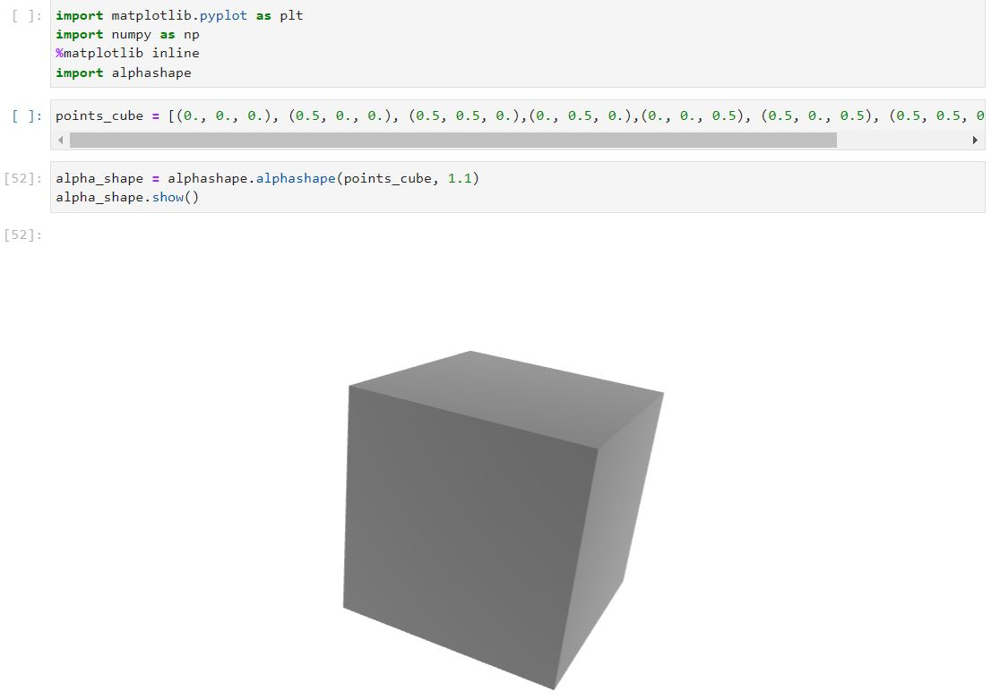
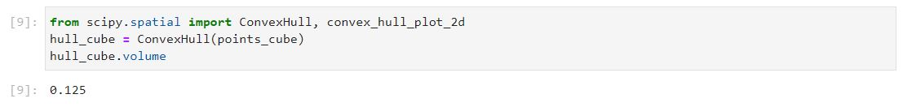
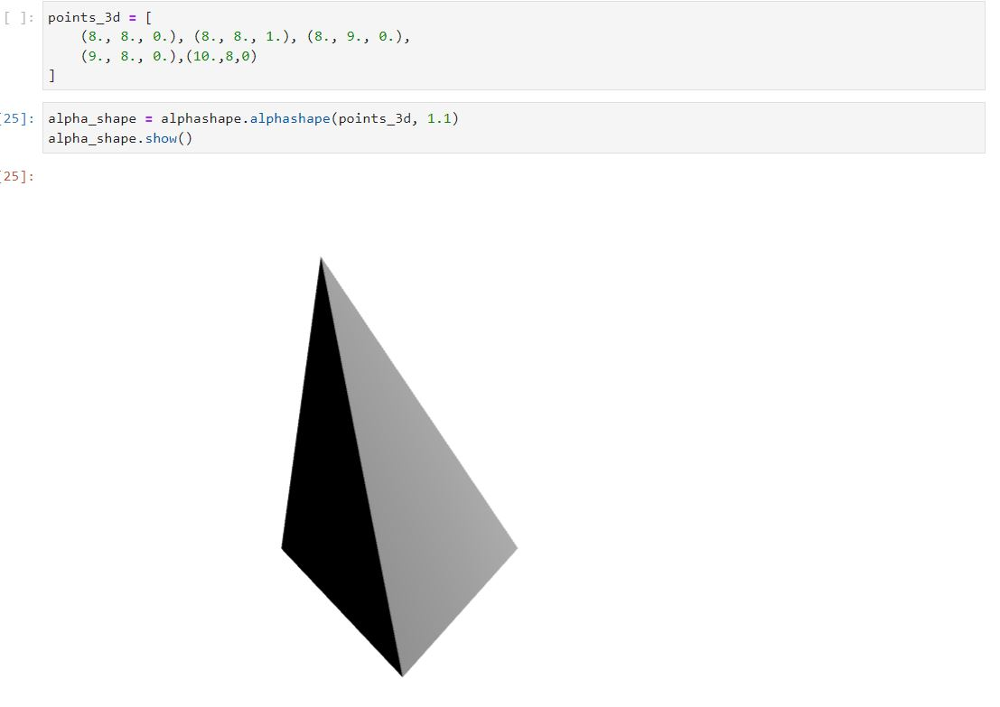
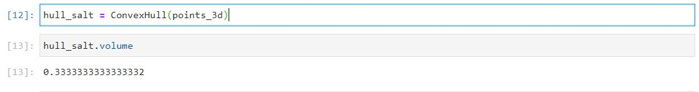

# Simple object volume calculation in image

Project describes a simple methodology that can be adopted in calculating the approximate volume of any object by means of image reference

# Assumptions made :
1. The intrinsic and extrinsic parameters of camera is constant throughtout inference.
2. The 3d points for the object of interest is available either by 3d contour or some detection algorithm.
3. Exact value of reference object dimensions is already available or has provision to calculate.

## Objects of Interest :


We will have 2 objects to start with , One is our reference object for which we will know all the dimensions in prior and the other one being our object of interest.

## Camera parameters :
The below intrinsic parameters are assumed to be constant in calculating the values for both our objects

1. scale :  focal length of the camera , Hence assuming the same camera setup.
2. pixel shape : rectangular or square , Hence assuming to be square
3. offset : The X axis value of placement of object , Hence assuming both our images to be in same image plane
4. Skew : if image plane is skewed or parallel , Hence assuming to be Parallel.

If any of this assumptions are changed than a recalculation w.r.t reference object would be needed 
basically the co-ordinates need to be recalculated using intrinsic parameter formula . 

````
(u, v) = [𝛼x/z - (𝛼y/z)cotθ + x0, (𝛽y / zsinθ) + y0]
````

Note: The extrinsic paramters dont really have a big play as we are focused just to pixel level (2d) so can be ignored.

## Process:

The whole process can be divided into 4 steps :

1. *Find 3d points* : Find the 3d points for the cuboid and object of interest(OOI) either by means of 3d detection or 2d detection + Z axis point coming from ground truth.

2. *Calibrating the Pixel density* : we place our reference object in the exact image space and find the 3d point cloud for it , since our object is a cuboid we need minimum of 8 points plotted over the image , once we have the points we try to find the convex hull volume of the cuboid with its 3d points .   

Ex: if the obtained 3d points for cuboid is [[(0., 0., 0.), (0.5, 0., 0.), (0.5, 0.5, 0.),(0., 0.5, 0.),(0., 0., 0.5), (0.5, 0., 0.5), (0.5, 0.5, 0.5),(0., 0.5, 0.5)]]

now we calculate the convex hull volume below for our reference object.




Now by knowing the actual volume of the cuboid we placed we can derive the Pixel density.

Ex: if the measured volume of the cube is 3 X 4 X 5 = 60 m^3 and our convex hull volume is 0.125
we calculate the pixel density as 60 / 0.125 = 480 .

3. *Find convex hull volume for OOI* : Apply the same process as above for our object of interest (salt dump) .

ex: if the obtained 3d points for the salt dump is  [(8., 8., 0.), (8., 8., 1.), (8., 9., 0.),(9., 8., 0.),(10.,8,0)]




4. *Find the real world volume of OOI* : Now we know the convex hull volume , so by multiplying pixel density with new convex hull volume one should be able to arrive at approximate volume of the salt .

Ex: 480 * 0.3333 = 160 m^3 .

## Future calculations :

if all the assumptions are true and the setup remains same then the same methedology can be applied for any object. 

The obtained value might not be exact but should approximate as convex hull would try to assume the material thickness is nil or zero.

## Metric for improvement:

The scope for improvement is bringing in other influencial parameters and iterating the process of calculating pixel density with different reference objects and considering the mean of those. 
